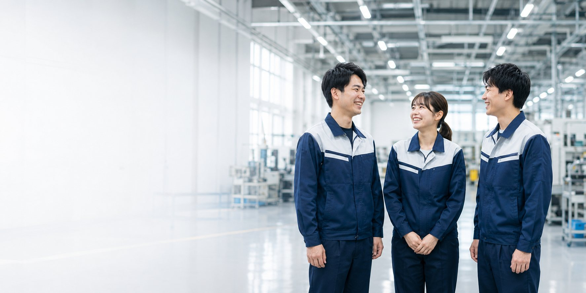

# HANDOFF｜株式会社ミライテック 採用LP制作案件

**作成日**：2026-07-28
**引き継ぎ理由**：作業環境を Cursor上のClaude Code → Claude Desktop上のClaude Code へ切り替え
**このファイルの目的**：このファイルだけを読めば、次のClaude Codeセッションが状況把握のための再調査なしに作業を再開できること。

---

## 1. プロジェクトの目的

Web制作案件獲得用の**ポートフォリオ作品**として、架空の自動車部品メーカー「株式会社ミライテック」の採用LP（ランディングページ）を制作している。

単なるデザイン作品ではなく、「製造業の採用LPを、企画・UX・デザイン・レスポンシブ・実装まで任せられる」と営業先・クラウドソーシングの発注者に伝わる品質を目標とする。

**重要**：本サイトはポートフォリオ用の架空企業であり、企業情報・求人情報・人物・数値等はすべて架空。この事実はサイト内のCASE STUDYセクションとフッターに明記済み（詳細は13章）。

---

## 2. 現在のディレクトリ構成

```
C:\Users\unear\portfolio-mirai-tech-lp\
├── index.html              … 全ページ本体（673行、17セクション）
├── css/
│   └── style.css           … スタイルシート一式（564行）
├── js/
│   └── main.js              … ナビ／アニメーション／フォーム制御（144行）
├── images/                  … 全12枚の実画像（JPEG+WebP、2026-07-28に全差し替え完了。詳細は5章）
│   └── _source/             … 差し替え前の元PNG（12点、バックアップ、サイトからは未参照）
├── image-prompts.md         … 全12枚のAI画像生成プロンプト一覧＋実装状況チェック
├── README.md                … Stage A/B の実装詳細レポート（本ファイルと役割が近いが、より実装詳細寄り）
└── HANDOFF.md                … 本ファイル
```

**Gitリポジトリではない**（`.git`なし）。バージョン管理は行っておらず、ファイルシステム上の状態がすべて。

**README.mdとの関係**：README.mdはStage A/Bの実装詳細（セクション構成、SEO/アクセシビリティ対応など技術的な網羅レポート）を持つ。本HANDOFF.mdは「次のセッションが迷わず再開するための要点」に絞った引き継ぎ資料。両方参照すると理解が早い。

---

## 3. Stage Aで完了した内容（実装完成）

指示書のPhase 1〜11に基づき、以下をすべて実装済み：

- **全17セクション**：HEADER／FV／働きやすさ（数字カウントアップ）／求職者の不安／未経験でも始められる3つの理由／仕事内容（4職種）／成長STEP（5段階）／職場環境／社員インタビュー（3名）／1日の流れ／待遇・福利厚生／募集要項／FAQ（アコーディオン）／最終CTA／応募フォーム（モック送信）／CASE STUDY／FOOTER
- **レスポンシブ**：モバイルファースト設計。375〜430px基準→768px（タブレット）→1024px（デスクトップ、ハンバーガー→フルナビ切替）→1280px
- **モバイル固定CTA**：画面下部に「職場見学／応募する」を固定表示（1024px未満）
- **アニメーション**：IntersectionObserverによるフェードアップ、数字カウントアップ、STEPライン進行、`prefers-reduced-motion`対応
- **SEO**：title/description/OGP、JobPosting構造化データ（JSON-LD）、見出し階層（h1は1つのみ）
- **アクセシビリティ**：スキップリンク、フォームlabel関連付け、FAQは`<details>/<summary>`、focus-visible、aria-expanded制御
- **画像プレースホルダー方式**：実写真が用意できるまで、全12箇所を「用途／推奨サイズ／アスペクト比／被写体／構図／雰囲気」を明記したプレースホルダーで実装（`.img-slot`コンポーネント、CSS内に定義）

Stage A完了時点で、HTML構文（Pythonパーサー検証）・CSS括弧対応・JS構文（`node --check`）・ID重複なし・アンカーリンク解決をすべて機械的に確認済み。

---

## 4. Stage Bで完了した内容

**現在のステータス：Stage B完了（2026-07-28）。優先度A・B・C＝全12枚の画像差し替え、色味・トーン統一監査、CASE STUDY最終調整、営業提示可否の自己監査まですべて完了。詳細は12章「最終品質監査」を参照。**

完了したこと（優先度A）：
1. 12枚分のAI画像生成プロンプトを作成（`image-prompts.md`、全ツール共通の「Style Anchor」方式で統一感を担保）
2. ユーザーから優先度A相当の2枚（FVメインビジュアル用アスペクト比3:2、最終CTA背景用アスペクト比2:1）の画像が`images/`フォルダに提供された
3. 画像の内容確認（Read toolで目視確認、Style Anchorの要件を満たしていることを確認：紺×白の統一作業着、清潔な工場、自然な表情、ロゴ・文字なし）
4. 画像最適化（PNG→JPEG/WebP、詳細は6章）
5. `index.html`のFV・最終CTAプレースホルダーを実画像（`<picture>`要素）に置き換え
6. PC（1440px, 768px）・スマホ（390×844, 375×667）での目視確認をPlaywrightスクリーンショットで実施
7. **発見した2件の不具合を修正**（詳細は8章）：見出しと人物の干渉、固定CTAバーとの重なり
8. 修正後の再検証（320px〜1440pxの主要幅で横スクロールなしを機械確認）
9. `README.md`と`image-prompts.md`のステータスを更新済み

完了したこと（優先度B・2026-07-28追加実施）：
1. ユーザーがダウンロードフォルダ（`C:\Users\unear\Downloads`）に配置したAI生成画像6枚（ChatGPT生成、2026年7月28日16時台のファイル）を確認・使用
2. 各画像を目視確認した結果、**2件の問題を発見しユーザーに確認の上で対応方針を決定**（詳細は次段落）
3. Pillowでクロップ・リサイズ・最適化し、`images/voice-tanaka` / `voice-suzuki` / `voice-sato`（600×600, JPEG/WebP）、`images/workplace-floor` / `workplace-break` / `workplace-locker`（1000×750, JPEG/WebP）として保存。元PNG（ダウンロードフォルダの直接提供ファイル）は`images/_source/`に`-original.png`として個別バックアップ
4. `index.html`の該当6箇所の`.img-slot`プレースホルダーを`<picture>`要素に置き換え
5. `css/style.css`に`.img-slot--photo`（プレースホルダー用の破線ボーダー・背景を除去）と`.img-slot img`（`object-fit:cover`）を追加
6. ローカルサーバー起動＋Chromiumプレビューで、PC（1440×900）・スマホ（375×667, 390×844）双方の実測検証（DOM実測・画像読み込み完了確認・横スクロールなし確認）を実施

**優先度B実装時に発見・ユーザー判断で対応した2件の重要事項（次セッションも要認識）**：
- **問題1：作業着に「ミライテック」の文字が写り込んでいた**。`image-prompts.md`のStyle Anchorは「no readable text／logo」を必須としており、優先度A(FV・最終CTA)の2枚は文字なしで承認済みだったが、優先度B提供画像3枚（社員インタビュー用）は全て胸元に社名文字が入っていた。→ **ユーザー判断：600×600の正方形に頭部〜首元のみでタイトにクロップし、文字を画角外に排除する方針で対応**（3枚とも文字が完全に見切れることを目視確認済み）。今後、優先度C（4枚）でも同様の文字混入がないか確認must。
- **問題2：想定人物設定と実際の写真の性別が不一致**。`image-prompts.md`の設定は「田中さん(男性)／鈴木さん(女性)／佐藤さん(30代男性リーダー)」だったが、提供された3枚は男性1名・女性2名で、佐藤さん相当の男性30代がいなかった。→ **ユーザー判断：コピー文言を写真に合わせて変更**。「佐藤 大輔さん（31歳・男性）」→「佐藤 真央さん（29歳・女性）」に変更（index.html:453付近）。役職・入社年次・前職・コメント文はそのまま維持。
- 職場環境3枚（生産フロア・休憩スペース・更衣室）は、プロンプトで想定していたスタッフの写り込みがなかったが、内容自体は用途に合致しており、そのまま採用した。

完了したこと（優先度C・2026-07-28追加実施）：
1. ユーザーがダウンロードフォルダに配置したAI生成画像4枚（ChatGPT生成、2026年7月28日18:19台のファイル）を確認・使用
2. 目視確認（文字・ロゴ混入なし、手指の破綻なし、仕事内容との整合性）を実施。**優先度Bで発生した2件の問題（ロゴ混入・属性不一致）は今回は発生しなかった**
3. `image-prompts.md`の画像9〜12（機械オペレーター／部品供給／製品検査／品質確認）と1対1で内容照合し割り当て
4. 元画像がすでに4:3（1448×1086）だったためクロップ不要。Pillowでリサイズ・最適化し、`images/job-operator` / `job-logistics` / `job-inspection` / `job-quality`（800×600, JPEG/WebP）として保存。元PNGは`images/_source/`にバックアップ
5. `index.html`の該当4箇所の`.img-slot`プレースホルダーを`<picture>`要素に置き換え（`img-slot--photo`クラス使用、CSS追加は不要・優先度Bで追加済みのルールを再利用）
6. ローカルサーバー起動＋ブラウザプレビューで、PC（1440×900）・スマホ（375×667）双方の実測検証を実施。全12枚（優先度A・B・C）が揃った状態で読み込み成功・横スクロールなしを最終確認

これで**全12枚の画像差し替えが完了**。

完了したこと（Stage B最終品質監査・2026-07-28追加実施）：
1. 全12枚＋FV・最終CTAをRead toolで並べて目視確認し、色味・トーンの統一監査を実施。`workplace-floor.jpg`（緑色の床）の彩度が他画像より強く浮いていたため、`css/style.css`に`saturate(0.72) brightness(1.02)`のフィルタを追加してCSSのみで調整（画像自体は再生成していない）。他11枚は大きな乱れなし
2. CASE STUDYセクションを監査。人物設定（佐藤さんの性別・年齢・役割）が全箇所で統一されていることを確認。数値訴求に誇大表現なし。DESIGN項目の文言を実装済みビジュアルに即した内容に更新（構造変更なし）
3. 営業提示可否の自己監査：ローカルサーバー＋ブラウザプレビューで、PC(1440px)・Tablet(768px)・Mobile(375px)を確認。ハンバーガーメニュー・FAQアコーディオン・応募フォーム（モック送信）の動作確認、全12枚の画像読み込み・alt属性・アンカーリンク・横スクロールなし・console/networkエラーなしを確認
4. `index.html`／`css/style.css`／`README.md`／`HANDOFF.md`／`image-prompts.md`を横断検索し、旧仕様の残存記述を確認・修正（`README.md`に2箇所残存していたプレースホルダー前提の文言を修正）
5. `README.md`をStage B完了として更新、本ファイル（HANDOFF.md）も同様に更新

**これでStage Bの完了条件（12章）をすべて満たした。**

---

## 5. 現在使用中の画像とファイル名

| ファイル | 用途 | 状態 |
|---|---|---|
| `images/fv-main.jpg` / `.webp` | FVメインビジュアル（背景） | ✅ 実装済み・調整済み |
| `images/final-cta.jpg` / `.webp` | 最終CTAセクション背景 | ✅ 実装済み・調整済み |
| `images/voice-tanaka.jpg` / `.webp` | 社員インタビュー：田中さん（顔写真） | ✅ 実装済み |
| `images/voice-suzuki.jpg` / `.webp` | 社員インタビュー：鈴木さん（顔写真） | ✅ 実装済み |
| `images/voice-sato.jpg` / `.webp` | 社員インタビュー：佐藤さん（顔写真、コピー文言変更あり・4章参照） | ✅ 実装済み |
| `images/workplace-floor.jpg` / `.webp` | 職場環境：生産フロア | ✅ 実装済み |
| `images/workplace-break.jpg` / `.webp` | 職場環境：休憩スペース | ✅ 実装済み |
| `images/workplace-locker.jpg` / `.webp` | 職場環境：更衣室 | ✅ 実装済み |
| `images/job-operator.jpg` / `.webp` | 仕事内容：機械オペレーター | ✅ 実装済み |
| `images/job-logistics.jpg` / `.webp` | 仕事内容：部品供給 | ✅ 実装済み |
| `images/job-inspection.jpg` / `.webp` | 仕事内容：製品検査 | ✅ 実装済み |
| `images/job-quality.jpg` / `.webp` | 仕事内容：品質確認 | ✅ 実装済み |
| `images/_source/*-original.png`（12点） | 各画像の元画像（未圧縮） | バックアップのみ、サイトから未参照 |

**全12枚の画像差し替えが完了**（プレースホルダーは0件、10章参照）。

---

## 6. 画像最適化・picture要素の実装方法

**最適化の手順**（Python + Pillow使用。`pip install Pillow`でインストール済みだったが、環境依存のため次セッションで再インストールが必要な可能性あり）：

```python
from PIL import Image
img = Image.open(src).convert('RGB')
img.save('xxx.jpg', 'JPEG', quality=84, optimize=True, progressive=True)
img.save('xxx.webp', 'WEBP', quality=82, method=6)
```

**効果**：元PNG 1.7〜1.9MB → JPEG 135〜150KB / WebP 60〜74KB（約92〜97%の削減）。

**HTML実装パターン**（`<picture>`要素、WebP優先・JPEGフォールバック）：

```html
<!-- FV（above the fold、優先読み込み） -->
<picture class="fv__img">
  <source srcset="images/fv-main.webp" type="image/webp">
  
</picture>

<!-- 最終CTA（below the fold、遅延読み込み） -->
<picture class="final-cta__img">
  <source srcset="images/final-cta.webp" type="image/webp">
  
</picture>
```

**CSSでの表示方法**（背景全面表示、`.fv__img`/`.final-cta__img`が`position:absolute; inset:0`、中の`img`が`object-fit:cover`）：

```css
.fv__img { position: absolute; inset: 0; width: 100%; height: 100%; }
.fv__img img { width: 100%; height: 100%; object-fit: cover; object-position: 74% 22%; }
```

`object-position`は「顔・手元など見せたい被写体がクロップで切れないための調整値」。画像ごとに構図が違うため、新しい画像を実装する際は都度、目視確認しながら調整すること（9章にPC/モバイル別の現在値を記載）。

**優先度B・Cで踏襲した手順**：Pillowで最適化（必要ならクロップも） → `<picture>`要素で配置 → `.img-slot`のプレースホルダーdivを置き換え、`img-slot--photo`クラスを追加。FV/最終CTAのような`object-position`による微調整ではなく、事前にPillowで正しいアスペクト比にクロップ・リサイズしてから保存することで、CSS側は`object-fit:cover`のみで済んだ（4章参照）。今後、新しい画像セクションを追加する場合もこの手順を踏襲するとよい。

---

## 7. PC・タブレット・スマホで行った検証内容

**検証方法**：Playwright（Chromiumヘッドレス）でスクリーンショット取得＋DOM実測（`getBoundingClientRect`）。詳細は15章。

**検証した幅**：320px, 375px, 390px, 414px, 430px, 768px, 1024px, 1440px

**検証項目と結果**：
- 横スクロール発生の有無 … 全幅でOK（`scrollWidth === clientWidth`を機械確認）
- FV画像のトリミング（PC/モバイル） … 修正後、両方とも被写体が適切にフレーム内
- 見出しテキストと画像（人物）の可読性・干渉 … 発見・修正（8章）
- CTAボタンの視認性 … 良好
- 固定CTAバーとの重なり … 発見・修正（8章）
- 最終CTA背景の構図・文字可読性 … 良好（PC：左テキスト＋右3名、モバイル：中央寄せテキスト＋2〜3名）
- タブレット幅（768px）… 崩れなし、良好

**未検証**：実機（実際のiPhone/Android端末）での確認は未実施。あくまでPlaywright（Chromiumエンジン）でのシミュレーション。SafariやAndroid標準ブラウザでの表示崩れの可能性はゼロではない。

---

## 8. 発見・修正した不具合

### 不具合1：モバイルで見出しテキストが人物の顔と重なり可読性が低下
- **原因**：FVのオーバーレイ（`.fv__overlay`）が、PC想定の「左右分割グラデーション」のままモバイルにも適用されており、モバイルでは文字が画面幅いっぱいに広がるため、写真の暗い部分・明るい部分と無関係に文字が乗ってしまっていた。
- **修正**：モバイル基準（デフォルト）のオーバーレイを、上部から強めに暗くする単純な縦グラデーションに変更。PC（1024px以上）でのみ、左右分割の軽いグラデーションに切り替える設計に変更（現在のCSSが正、9章に現在値を記載）。

### 不具合2：375×667（iPhone SE等の低め端末）でFV内のCTAボタンが画面下部固定CTAバーと重なる
- **根本原因（重要・要注意）**：CSSの詳細度バグ。汎用ルール
  ```css
  section[class] { padding: var(--section-py) 0; }
  ```
  の詳細度が `(0,1,1)`、一方`.fv { padding: 0; }`の詳細度が`(0,1,0)`のため、**`.fv`の`padding:0`が意図せず上書きされ**、モバイルでFVセクションに上下56px程度の余計なpaddingが追加されていた。これによりFVセクション全体が想定より高くなり、中のCTAボタンが画面下部の固定バー（`.mobile-cta`, `position:fixed`）と重なっていた。
  **これはStage A完成時点から潜在していたバグ**で、実写真を入れてピクセル単位の検証を行って初めて顕在化した。プレースホルダーだけを見ていた段階では気づけなかった。
- **修正**：`section[class]:not(.fv):not(.final-cta) { padding: var(--section-py) 0; }` として、FVと最終CTAをこの汎用ルールから除外し、それぞれに明示的なpadding指定を持たせた（`.final-cta`には`padding: var(--section-py) 0;`を追加、`.fv`は元々`padding:0`のままで正しく機能するようになった）。
- **副次的な追加修正**：スクロール誘導の「SCROLL」インジケーター（`.fv__scroll`）が、上記修正後もモバイルでCTAボタンと視覚的に重なっていたため、**モバイルでは非表示、PC（1024px以上）のみ表示**に変更。
- **さらにモバイル用に調整した値**：`.fv`のmin-height、`.fv__content`のpadding、見出し類のmarginをモバイル用に圧縮（PC側は従来通りの余裕あるサイズを1024px以上のメディアクエリで再指定）。

**次セッションへの教訓**：`section[class]`のような汎用セレクタに対して個別セクションで`padding:0`のような上書きを行う場合、CSS詳細度を必ず確認すること。今後新たに全面ビジュアル型セクションを追加する場合は同じ罠に注意。

---

## 9. 現在のCSS・レスポンシブ設計上の重要事項

### ブレークポイント
- モバイル（デフォルト）：〜767px
- タブレット：768px以上（`@media (min-width: 768px)`）
- デスクトップ：1024px以上（`@media (min-width: 1024px)`）— ハンバーガー→フルナビ切替、モバイル固定CTA非表示
- 大画面：1280px以上（`@media (min-width: 1280px)`）— FVタイトルのフォントサイズ調整のみ

### FVセクション（`.fv`）の現在値
```css
.fv { min-height: min(78vh, 680px); /* モバイル基準 */ }
.fv__content { padding-top: 44px; padding-bottom: 16px; /* モバイル基準 */ }
.fv__img img { object-position: 74% 22%; /* モバイル基準 */ }
.fv__overlay { /* モバイル：上部から強めに暗くする縦グラデーション（0.46→0.96） */ }
.fv__scroll { display: none; /* モバイル非表示 */ }

/* 1024px以上で上書き */
.fv { min-height: 88vh; }
.fv__content { padding-top: 0; padding-bottom: 100px; }
.fv__title { margin-bottom: 16px; } .fv__sub { margin-bottom: 24px; } .fv__badges { gap:10px; margin-bottom:30px; }
.fv__img img { object-position: 62% 28%; }
.fv__overlay { /* PC：左右分割グラデーション（左を暗く、右の写真を見せる） */ }
.fv__scroll { display: flex; }
```

### 最終CTAセクション（`.final-cta`）の現在値
```css
.final-cta { text-align: center; padding: var(--section-py) 0; /* モバイル基準：中央寄せ */ }
.final-cta__img img { object-position: 65% 40%; }
.final-cta__overlay { background: linear-gradient(180deg, rgba(10,20,40,0.58) 0%, rgba(10,20,40,0.74) 100%); }

/* 1024px以上で上書き */
.final-cta { text-align: left; /* 左寄せに変更、写真の見える面積を確保 */ }
.final-cta__overlay { /* 左右分割グラデーション */ }
.final-cta__buttons { justify-content: flex-start; }
```

### 画像プレースホルダーコンポーネント（全12枚差し替え完了、現在は使用中プレースホルダーなし）
`.img-slot`クラス（`css/style.css`内、行番号は変動する可能性があるため`grep ".img-slot"`で検索推奨）。破線ボーダー＋斜線パターン背景＋SVGアイコン＋用途/サイズ/被写体等のメタ情報リストを表示する見た目は、実画像を持つ要素には`.img-slot--photo`クラスを追加することで自動的に解除される（破線ボーダー・背景が消え、`object-fit:cover`の写真表示になる）。今後、何らかの理由で画像を差し戻す/新しいプレースホルダーを追加する場合は、6章のパターンを参照。

### 重要な注意点（罠）
- **`section[class]`の詳細度罠**（8章参照）：新しいセクションで`padding`を独自制御したい場合、必ず`section[class]:not(.xxx)`のように除外リストに追加するか、`section.xxx`のように詳細度を上げること。
- **`.fv`と`.final-cta`はモバイル/デスクトップでオーバーレイのグラデーション方向が異なる**（モバイル＝縦のみ、PC＝縦+横の分割）。新しい全面ビジュアル型セクションを追加する場合、同じ設計思想（モバイルは均一に暗く、PCは余白側だけ暗く）を踏襲すると統一感が出る。
- 全体としてビルドツール・フレームワーク不使用（素のHTML/CSS/JS）。依存関係はGoogle Fonts CDN（Noto Sans JP）のみ。

---

## 10. 画像差し替えの完了状況（優先度A・B・C＝全12枚）

優先度A（FV・最終CTA）は最初のセッションで、優先度B（社員インタビュー3点・職場環境3点）・優先度C（仕事内容カード4点）は2026-07-28に実装完了（4章参照）。**残っている画像プレースホルダーは0件**。詳細なプロンプトは `image-prompts.md` に全12枚分記載済み（実装済みマーク付き）。

| # | 用途 | サイズ | 比率 | 状態 |
|---|---|---|---|---|
| 1 | FVメインビジュアル | 2400×1600px以上 | 3:2 | ✅ |
| 2 | 最終CTA背景 | 2400×1200px | 2:1 | ✅ |
| 3〜5 | 社員インタビュー：田中さん／鈴木さん／佐藤さん | 600×600px | 1:1 | ✅ |
| 6〜8 | 職場環境：生産フロア／休憩スペース／更衣室 | 1000×750px | 4:3 | ✅ |
| 9〜12 | 仕事内容：機械オペレーター／部品供給／製品検査／品質確認 | 800×600px | 4:3 | ✅ |

---

## 11. 画像差し替え作業で確立した手順（今後、画像を追加・入れ替える場合の参考）

優先度B・Cの実装（2026-07-28）で確立した手順・注意点。今後、画像の追加・再生成・入れ替えが必要になった場合はこの手順を踏襲する。

1. ユーザーから画像ファイルを受け取り、配置場所（`images/`直下か、ダウンロードフォルダ等）を確認
2. 各画像の内容をRead toolで目視確認し、Style Anchor要件（**ロゴ・文字なし**、紺×白統一、自然な表情等）を満たしているか確認。**優先度Bでは3枚が作業着に社名文字が写り込んでいた実績があるため、必ず確認すること**。文字が入っていた場合はタイトクロップで排除可能か検討し、対応方針をユーザーに確認する。
3. 想定していた被写体（性別・年齢・作業内容）と実際の画像内容が一致するか確認。一致しない場合はコピー文言側を写真に合わせて変更するか、ユーザーに判断を仰ぐ（優先度Bでは佐藤さんの性別設定をコピー変更で解決した実績あり）。
4. Pillowで最適化（JPEG quality84 + WebP quality82、6章のスクリプト踏襲）。クロップが必要な場合は先に候補クロップを生成しRead toolで目視確認してから確定。`images/_source/`に元ファイルをバックアップ（`<name>-original.png`）
5. 該当する`.img-slot`プレースホルダーを`<picture>`要素に置き換え（`grep -n "img-slot"`で検索）。CSSクラス`img-slot--photo`を追加すればプレースホルダーの破線ボーダー・背景が自動的に外れる（`object-fit:cover`は`.img-slot img`に既定済み）
6. 1枚ずつ差し替え、都度ローカルサーバー起動＋ブラウザプレビューでPC/モバイル双方を確認（一括差し替え後にまとめて確認すると問題の切り分けが難しくなるため、1枚ずつ推奨）
7. `README.md`と`image-prompts.md`のステータスを都度更新

---

## 12. 全画像差し替え後の最終監査（Stage B完了条件）✅ 完了（2026-07-28）

元の指示書（Stage B着手時の指示）に基づく項目と、実施結果：

- **全セクションの色味・写真トーン・余白の統一監査** … ✅ 実施済み。12枚＋FV・最終CTAを並べて目視確認した結果、`workplace-floor.jpg`（生産フロアの緑色の床）が他画像の落ち着いたブルー／グレー系トーンより彩度が強く浮いていたため、`css/style.css`に`.workplace__gallery .img-slot--photo img { filter: saturate(0.72) brightness(1.02); }`を追加（画像自体の再生成はしていない）。他11枚（社員インタビュー3名の顔写真同士、仕事内容4点同士等）は明るさ・彩度・色温度に大きな乱れなし。
- **FVのビジュアル品質最終確認** … ✅ 実施済み。全画像が揃った文脈でも浮いていないことを確認。
- **スマホ表示の最終監査** … ✅ 実施済み。375px幅で12枚すべてのクロップ・可読性を確認。社員インタビューの丸型トリミングは3名とも顔が中央に来ていることを確認。
- **営業先に見せられる品質かの自己監査** … ✅ 実施済み（詳細は下記「Stage B最終品質監査の実施結果」）。

### Stage B最終品質監査の実施結果（2026-07-28）
- **確認環境**：ローカルサーバー（`python -m http.server 5500`）＋Claude Codeのブラウザプレビュー機能、PC(1440×900)・Tablet(768×1024)・Mobile(375×667)
- **確認項目と結果**：全12枚の画像読み込み成功（`naturalWidth>0`を実測）／横スクロールなし（`scrollWidth===clientWidth`を3幅で確認）／alt属性は全``に付与済み／アンカーリンク切れなし／ハンバーガーメニュー・FAQアコーディオン・応募フォーム（モック送信）の動作確認／console出力なし／network失敗リクエストなし
- **見つかった軽微な問題と対応**：上記の`workplace-floor.jpg`の彩度のみ。CSSフィルタで解消。他に重大な問題（AI生成特有の破綻、ロゴ・文字混入、レイアウト崩れ等）は見つからなかった
- **既知の環境上のクセ**（次回作業時の参考）：`location.reload()`直後は`preview_eval`が古いドキュメント参照を返すことがある（15章の既知現象と同様）。この場合は`preview_stop`→`preview_start`で解消する。

---

## 13. CASE STUDYの最終調整 ✅ 完了（2026-07-28）

`index.html`内CASE STUDYセクション（`<section class="case-study">`）を監査・調整済み。含まれる内容：PROJECT/OBJECTIVE/TARGET/DESIGN/SCOPEの5項目リストと、架空企業である旨の注意書き（`.case-study__disclaimer`）。

**実施内容**：
- 人物設定（社員インタビューの佐藤さんの性別・年齢・役割）が`index.html`全箇所で統一されていることを確認（矛盾なし）
- 「DESIGN」項目の説明文を、実際に完成したビジュアルの特徴に即した文言に更新：「ネイビー×ブルーを軸にした製造業らしい信頼感と、実写真・柔らかいコピーで若手求職者が応募しやすい親しみやすさを両立」（旧文言は「製造業の信頼性と、若手求職者が応募しやすい親しみやすさを両立」）
- セクション構造・他の項目（PROJECT/OBJECTIVE/TARGET/SCOPE）は変更なし
- 架空企業である旨の免責表示（`.case-study__disclaimer`）は変更・削除していない（ユーザー指示に基づく必須要件、継続して遵守）
- 数値訴求（働きやすさセクションの残業時間・有給取得率等）に誇大表現がないことも合わせて確認済み。架空の設定値である旨の注記（`.stats__note`）も明記済み

---

## 14. ローカルサーバー起動方法

**標準の確認方法（推奨）**：

```bash
cd C:\Users\unear\portfolio-mirai-tech-lp
python -m http.server 5500
```

ブラウザで `http://localhost:5500/` を開く。終了は `Ctrl+C`。

**現在、サーバーは起動していない**（優先度Bの検証作業後に停止済み）。

**Node.js環境がある場合の代替**：`npx http-server -p 5500`

**2026-07-28追加：`.claude/launch.json`を作成済み**（Claude Desktop側で有効な「Launch」機能用の設定ファイル、プロジェクトルートに配置）。内容は`python -m http.server 5500`をポート5500で起動する設定。この設定ファイル自体はGit管理されていないファイルシステム上に存在するのみだが、プロジェクトフォルダ内に永続化されているため、次セッションでも`preview_start`系のツール（名前:`lp-preview`）から即座にサーバーを起動できる。

---

## 15. ブラウザ検証環境（2026-07-28更新：Playwrightからプレビューツールに変更）

**重要：前回HANDOFFで案内していたセッション固有スクラッチパッドのPlaywright環境は、今回のセッションでは実際には存在せず、想定通り再構築が必要だった。** 今回は代わりに、Claude Code内蔵のブラウザプレビュー機能（`preview_start`/`preview_eval`/`preview_inspect`/`preview_screenshot`等のツール群）を使用した。前章の`.claude/launch.json`を作成済みのため、次セッションでは以下の手順でそのまま使える：

1. `preview_start`（name: `lp-preview`）でサーバー起動
2. `preview_resize`でPC幅（例：1440×900）・モバイル幅（例：375×667, 390×844）に切り替え
3. `preview_eval`で`document.getElementById('セクションid').scrollIntoView()`等を実行し、対象セクションを表示
4. `preview_screenshot`で見た目を確認、または`preview_inspect`で要素のサイズ・座標を実測（`getBoundingClientRect`相当）

**既知の不安定挙動（次セッションで遭遇する可能性あり）**：
- `preview_screenshot`が30秒でタイムアウトし続ける場合がある（原因不明、ページ自体は正常）。この場合は`preview_inspect`（サイズ・座標の数値実測）で代替検証すること。
- `location.reload()`をevalで実行した直後、しばらく`preview_eval`が古いドキュメント参照を返し続ける（`scrollTo`が効かない、`naturalWidth`が0のまま等）現象が発生した。この場合は`preview_stop`→`preview_start`でサーバー/プレビューセッションを再起動すると解消する。
- ローカルの`python -m http.server`は簡易的なシングルスレッド実装のため、多数の画像を同時リクエストすると`net::ERR_CONNECTION_RESET`が単発で発生することがある（優先度B・C実装時にそれぞれ1回、計2回発生）。ページリロード（`location.reload()`）だけで再取得に成功しており、実ファイルの破損ではない。画像が正しく配置されているのにブラウザ上で読み込み失敗する場合は、まずこれを疑うこと。

---

## 16. 次のClaude Codeセッションが最初に行うべき作業

**Stage Bは2026-07-28に完了済み**（全12枚の画像差し替え、色味・トーン統一監査、CASE STUDY最終調整、営業提示可否の自己監査まで完了。詳細は4章・12章・13章）。次セッションでは以下を想定：

1. **本HANDOFF.mdを読む**（このファイル）
2. `README.md`と`image-prompts.md`のステータス欄も念のため確認し、本ファイルの記述と齟齬がないか確認（もし齟齬があれば本ファイルより実ファイルの記述を優先し、状況を再調査する）
3. **Stage Bの作業内容自体に追加のタスクは残っていない**。ユーザーに次の方向性を確認する：
   - このままStage B完成版として営業・クラウドソーシングに提示するか
   - 実機（実際のiPhone/Android、Safari等）での最終確認を追加で行うか（7章参照：Playwright/Chromiumでのシミュレーションのみで実機確認は未実施）
   - 本番公開に向けた対応（`noindex`解除、実際のドメイン・アナリティクス設定等）に進むか
   - その他の改善（多言語対応、追加セクション等、いずれもStage Bのスコープ外）
4. 何らかの修正・追加作業を行う場合は、ローカルサーバー起動（14章）とブラウザプレビュー環境（15章）を用意し、実データでの目視確認を必ず行うこと（8章の教訓：構造的な検証だけでは発見できない不具合がある）。

**このプロジェクトで得られた最大の教訓**：CSS詳細度の罠（8章）のように、構造的な検証（HTMLタグ整合性、CSS構文チェックなど）だけでは発見できない不具合が、実際のビジュアル確認で初めて見つかることがある。今後も新しいセクション・画像を追加する際は、コードレベルの検証だけでなく、複数のビューポート幅で実際にスクリーンショットを取って確認する習慣を継続すること。

---

## 17. SEO監査対応（2026-08-02）

`research/audit-2026-08-01.md`「A. ポートフォリオ品質」は本作について「og:image/canonical/sitemap欠落」と指摘していたが、`index.html`を実測したところ**canonical（9行目）とog:image（14行目）は既に実装済み**だった（監査時点より後、あるいは監査自体が実態とずれていたと推定）。変更は加えていない。

`sitemap.xml`のみ実在しなかったため、リポジトリ直下に新規追加した（1ページ構成のLPのため`https://kenvhana510.github.io/portfolio-mirai-tech-lp/`の1URLのみを記載）。`robots.txt`は元々存在せず、本サイトは意図的に`noindex, nofollow`のデモサイトのため、今回は追加していない。

---

## 18. 実ブラウザQA（2026-08-02、品質改善パス後の検証セッション）

前セクション（品質改善パス：SEO/OGPメタタグ追加、コントラスト修正、絵文字→SVGアイコン化、死んだリンク削除）の実装後、**実ブラウザでの視覚的QA**を実施した。

**環境上の制約と対応**：Claude-in-Chrome MCP拡張がこのセッションでは接続不可だったため、代わりに`chrome.exe --headless=new`をChrome DevTools Protocol（CDPの`Emulation.setDeviceMetricsOverride` + `Page.captureScreenshot`）経由で直接操作し、正確なビューポート幅でのスクリーンショット取得とDOM実測を行った。

**検証したビューポート幅**：320 / 375 / 390 / 414 / 768 / 1024 / 1280 / 1440 / 1920px（9幅）。全幅で`document.documentElement.scrollWidth === window.innerWidth`を実測確認し、横スクロール・水平オーバーフローは**ゼロ件**。

**ハマった点（次セッションへの申し送り）**：
- `chrome --headless --window-size=W,H --screenshot`（CLIフラグ方式）は、このマシンのOS/ディスプレイスケーリングの影響で要求した論理幅どおりに描画されない場合がある（例：`--window-size=375`を指定しても実際の`innerWidth`が526になるなど、不安定）。`--force-device-scale-factor=1`を付けても解消しないケースがあった。**正確な幅で検証する場合はCDPの`Emulation.setDeviceMetricsOverride`を使うこと**（`--window-size`のCLIフラグに頼らない）。
- 本サイトは`.reveal`（IntersectionObserverによるフェードイン）と`loading="lazy"`画像を使っているため、ページ最上部から一度もスクロールせずに`captureBeyondViewport`でフルページキャプチャすると、ファーストビュー以降のセクションが**素の状態（opacity:0・画像未読込）で写ってしまう**。検証前に実際に`window.scrollTo`で最下部まで段階的にスクロールし、`.reveal.is-visible`が全要素に付与されたことを確認してからスクリーンショットを撮ること。

**発見・修正したバグ（1件）**：
- `.checkbox-label`要素が`.apply-form__field`（`flex-direction: column`）と`.checkbox-label`（`flex-direction`を指定せず`align-items:center`のみ）の2クラスを併せ持っており、CSSカスケードにより`flex-direction: column`が生き残っていた。結果、応募フォームの個人情報同意チェックボックスと同意テキストが**横並びではなく縦積みで表示される**バグがあった（Stage B完成時点から潜在していた可能性が高い。実写真確認や自動テストでは気づけない、実ブラウザでの目視確認で初めて発見）。`.radio-label, .checkbox-label`ルールに`flex-direction: row`を明示追加して修正。`getComputedStyle`とチェックボックス／テキストのY座標差（修正後 約2.6px、修正前は数十px以上）で修正を確認済み。
- それ以外のセクション（ヘッダー、FV、統計カード、8種の新SVGアイコングリッド、職場環境ギャラリー、社員インタビュー、仕事内容カード、成長STEP、募集要項テーブル、FAQ、最終CTA、フッター、モバイル固定CTA）は9幅すべてで表示崩れ・オーバーフロー・カード高さ不揃いなし。新しいSVGベネフィットアイコン8種も375/768/1440pxで正しいサイズ・色・viewBoxで描画確認済み。

**OGP画像の所見**：`images/fv-main.jpg`（1536×1024、3:2比率）をog:image/twitter:imageに使用しているが、Facebook/Twitterが推奨する1.91:1（例：1200×630）より正方形寄り。多くのプラットフォームは中央クロップで対応するため致命的ではないが、専用のOGP画像（1200×630前後）を別途用意すればより最適。今回は指示によりスコープ外として作成していない。

**静的検証の再確認**：HTMLタグ対応（div/section/svg/a）、CSS括弧対応、重複ID、見出し階層（h1×1、階層飛びなし）、全12枚`img`のalt属性、アンカーリンク解決、JobPosting JSON-LDのJSON妥当性、`node --check`によるJS構文チェックをすべて再実施し、いずれも問題なし。

**コミット**：本セッションでは以下5件をローカルコミットした（**pushは行っていない**、6章の運用ルールどおりリポジトリはoriginより進んだ状態を維持）。
1. `feat(seo): add canonical, OGP image, Twitter Card, and theme-color meta`
2. `fix(a11y): raise fine-print text contrast to WCAG AA, add FAQ hover`
3. `feat: replace emoji benefit icons with accessible SVG icon set`
4. `fix: remove dead consent-checkbox link, fix checkbox-label stacking`
5. `docs(seo): record SEO audit findings and add sitemap.xml`（並行セッションの未コミット分を引き継いで記録）

**残課題**：
- 実機（実際のiPhone/Android、Safari等）での確認は依然未実施（7章から継続）。
- OGP画像を1.91:1専用に作り直すと、より社会的共有時の見栄えが向上する（優先度低）。
- Claude-in-Chrome MCP拡張が使えるセッションでは、そちらでの再検証も可能（今回はCDP直接操作で代替）。

---

## 19. v2リデザイン（2026-10-06、ブランチ `redesign/v2`・未push）

ポートフォリオ6サイト共通ブリーフに基づき、`index.html` / `css/style.css` / `js/main.js` を「Industrial / Energetic / Future-facing」方向で全面刷新した。**main は未変更。push していない。**

- **維持したもの**：`noindex, nofollow`、架空企業注記（CASE STUDY・フッター・stats注記・フォーム注記）、LEGACRAFTへの戻りリンク、JSON-LD、会社名・求人文言・数値・社員の声（旧版の表示文字列はすべて残存することを機械確認済み）、フォームのモック送信挙動。
- **外部スクリプト**：cdnjs の GSAP 3.13.0（gsap.min.js / ScrollTrigger.min.js）のみ。GSAP未読込・`prefers-reduced-motion` では全要素を即表示、JS無効でも全コンテンツ可読（`html.js` クラス付与後にのみ非表示化）。
- **シグネチャ演出**：ヒーロー（Ken Burns＋斜め光スイープ＋行スタガー＋スクロール連動）／「スタッフの1日」のPC横ピンスクロール（SPは縦リスト）／カウントアップ＋プログレスリング／社員の声は scroll-snap カルーセル（ライブラリ不使用）／職場環境フォトグリッド（ホバーで拡大＋キャプション）／巨大英字キッカーのパララックス／マーキー帯／マグネットボタン／ヘッダー縮小＋全画面ドロワー。
- **画像**：新規9枚（`images/v2-*.webp`、合計約980KB、各300KB以下）。プロンプトと配置は `image-prompts-v2.md`。既存12枚は削除せず継続使用（JPEGフォールバックは外し WebP のみ参照）。
- **検証**：Playwright（Chromium）で 390 / 768 / 1366 幅のフルページ撮影、横オーバーフロー0、全 `` naturalWidth>0、console error 0。ドロワー開閉・フォームモック送信・reduced-motion・JS無効・横ピンのスクロール中状態も確認。
- **注意**：`python -m http.server` は画像同時リクエストで `ERR_CONNECTION_RESET` が出る（15章既知）。検証時は Node の簡易静的サーバーを使った。横ピンスクロールのため、フルページ撮影では「スタッフの1日」の下に pin-spacer 分の暗いテクスチャ帯が写る（実ブラウザでは固定表示される領域であり、崩れではない）。
